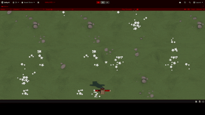

# Top-Down Food Thrower
A top-down arcade-style game developed in Unity where the player throws food at incoming animals to prevent them from crossing the screen.

This project was built as part of the Unity Learn Junior Programmer pathway and focuses on core gameplay programming concepts.

## Gameplay

## Features
- Top-down movement system
- Projectile (food) throwing mechanic
- Random enemy spawning
- Collision detection system
- Simple arcade-style gameplay loop

## Built With
- Unity
- C#
